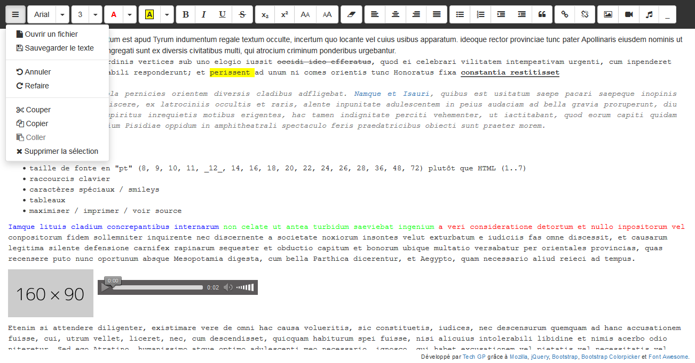

# webapps-editor

A simple HTML editor using [document.execCommand](https://developer.mozilla.org/en-US/docs/Web/API/Document/execCommand) capabilities

## Présentation

[Cette application](http://techgp.fr/webapps/webapps-editor.html) écrite en HTML5, JavaScript et CSS3 est un éditeur de texte [WISIWYG](https://fr.wikipedia.org/wiki/What_you_see_is_what_you_get) pour l'HTML.

Les librairies suivantes ont été utilisées pour cette application :

- [jQuery 2.2.4](http://jquery.com/) sous licence MIT
- [Bootstrap 3.3.6](http://getbootstrap.com/css/) sous licence MIT
- [Bootstrap Colorpicker 2.3.0](https://github.com/mjolnic/bootstrap-colorpicker/) sous licence Apache 2.0
- [Font Awesome 4.5.0](http://fortawesome.github.io/Font-Awesome/) SIL OFL 1.1 (police) et MIT (code)

L'application est fournie avec un fichier manifest `webapps-editor.appcache` permettant la mise en cache et l'utilisation en mode déconnecté. Plus d'info chez Mozilla [en français](https://developer.mozilla.org/fr/docs/Utiliser_Application_Cache) ou [en anglais](https://developer.mozilla.org/en-US/docs/Web/HTML/Using_the_application_cache).

NB : quand le certificat HTTPS est incorrect, la mise en cache échouera sous Chrome avec l'erreur `Manifest fetch Failed (9)`. Dans ce cas, faites les tests en HTTP et/ou utilisez un certificat valide en production.

## Captures d'écran

### Présentation de l'IHM

### Changelog

2016-03-15
- Première version

2016-03-16
- passage en menu de toutes les actions non liées à la mise en forme (ouvrir, enregistrer, annuler, refaire, couper, copier, coller, supprimer)
- restauration de la taille des "dropdown-toggle" car plus facile pour viser en tactile
- réorganisation des actions restantes pour faciliter le dimensionnement
- ajouter d'un listener $(window).on('resize', ...) pour ajuster le début de la zone d'édition

2016-03-17
- ajout de la fonction "Ouvrir un fichier"
- ajout de la fonction "Sauvegarder le texte"
- ajout d'une capture(s) d'écran utilisée dans README
- correction d'un bug sur le surlignage sous Chrome

2016-03-18
- ajout du favicon

2016-03-25
- changement de favicon
- mise à jour de jQuery en 2.2.2

2016-05-22
- correction de la mise en cache de FontAwesome
- mise à jour de jquery 2.2.4
- ajout de la section ChangeLog
