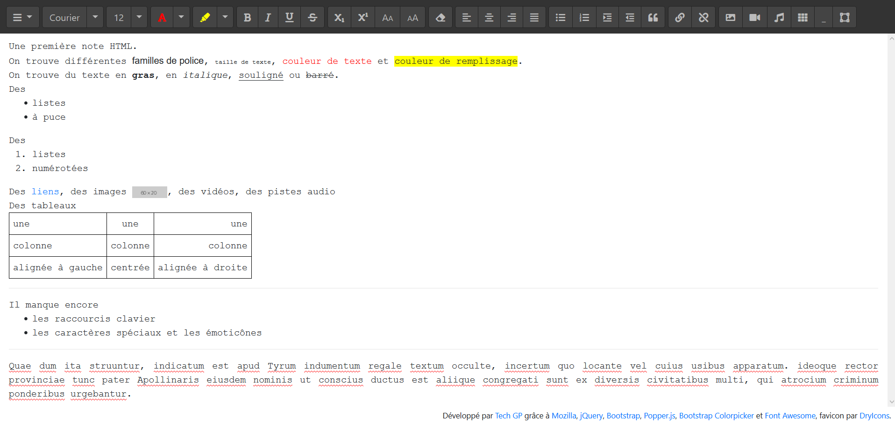

# webapps-editor

A simple HTML editor using [document.execCommand](https://developer.mozilla.org/en-US/docs/Web/API/Document/execCommand) capabilities

## Présentation

Cette application écrite en HTML5, JavaScript et CSS3 est un éditeur de texte [WISIWYG](https://fr.wikipedia.org/wiki/What_you_see_is_what_you_get) pour l'HTML.

Les librairies suivantes ont été utilisées pour cette application :

- [jQuery 3.5.0](https://jquery.com/) sous licence MIT
- [Bootstrap 4.4.1](https://getbootstrap.com/) sous licence MIT
- [Bootstrap Colorpicker 3.2.0](https://github.com/itsjavi/bootstrap-colorpicker/releases) sous licence MIT
- [Popper.js 1.16.1](https://popper.js.org/) sous licence MIT
- [Font Awesome 5.13.0](https://fontawesome.com/) SIL OFL 1.1 (police) et MIT (code)
- [DryIcons](https://dryicons.com/) pour le favicon

L'application devrait fonctionner correctement est mode déconnecté grâce aux **Service Workers** sous Chrome, Firefox et [d'autres](https://caniuse.com/#search=service+worker).
Plus d'infos chez [Google](https://developers.google.com/web/fundamentals/primers/service-workers/) ou [Mozilla](https://developer.mozilla.org/en-US/docs/Web/API/Service_Worker_API/Using_Service_Workers).

## Captures d'écran

### Présentation de l'IHM

## Licence

Ce projet est distribué sous licence MIT, reproduite dans le fichier LICENSE ici présent.

## Changelog

2016-03-15
- première version

2016-03-16
- passage en menu de toutes les actions non liées à la mise en forme (ouvrir, enregistrer, annuler, refaire, couper, copier, coller, supprimer)
- restauration de la taille des "dropdown-toggle" car plus facile pour viser en tactile
- réorganisation des actions restantes pour faciliter le dimensionnement
- ajouter d'un listener $(window).on('resize', ...) pour ajuster le début de la zone d'édition

2016-03-17
- ajout de la fonction "Ouvrir un fichier"
- ajout de la fonction "Sauvegarder le texte"
- ajout d'une capture(s) d'écran utilisée dans README
- correction d'un bug sur le surlignage sous Chrome

2016-03-18
- ajout du favicon

2016-03-25
- changement de favicon
- mise à jour de jQuery en 2.2.2

2016-05-22
- correction de la mise en cache de FontAwesome
- mise à jour de jquery 2.2.4
- ajout de la section ChangeLog

2016-06-28
- ajout du fichier LICENCE

2016-07-16
- mise à jour de Font Awesome (4.5.0 vers 4.6.3)

2017-05-21
- mise à jour de jQuery (2.2.4 en 3.2.1), Bootstrap (3.3.6 en 3.3.7), Bootstrap ColorPicker (2.3.0 en 2.5.0) et Font Awesome (4.6.3 en 4.7.0)

2018-08-12
- ajout d'un bouton pour l'insertion d'un tableau (3x3 par défaut) avec les contrôles du navigateur pour ajouter/supprimer des lignes/colonnes
- utilisation des Service Workers pour la mise en cache au lieu de [Application Cache](https://developer.mozilla.org/fr/docs/Utiliser_Application_Cache)
- utilisation de flexbox pour gérer la position de la barre en haut, du pied-de-page et de la partie centrale
- mise à jour de jQuery (3.2.1 en 3.3.1) + correction d'un bug suite à la suppression de "andSelf"
- mise à jour de Bootstrap (3.3.7 en 4.1.3) + correction du DOM, principalement pour les ".dropdown-menu"
- mise à jour de Bootstrap ColorPicker (2.5.0 en 2.5.3) mais la version 3.x a été écartée pour le moment
- mise à jour de Font Awesome (4.7.0 en 5.2.0) + correction des icônes video-camera => video, repeat => redo et remove => backspace
- intégration de Popper.js (1.14.4), dépendance de Bootstrap 4.x

2018-08-25
- accès plus direct aux couleurs personnalisées (texte et fond) et profitant de l'option "colorSelectors" du composant "colorpicker"

2019-02-22
- mise à jour des dépendances (Bootstrap 4.1.3 => 4.3.1, Font Awesome 5.2.0 => 5.7.2, Popper.js 1.14.4 => 1.14.7)
- taille de fonte en "pt" (8, 9, 10, 11, _12_, 14, 16, 18, 20, 22, 24, 26, 28, 36, 48, 72) plutôt que HTML (1..7)

2019-02-23
- ajout de la fonction "Voir le source"
- ajout de la fonction "Imprimer"
- correction de "enableObjectResizing" et "enableInlineTableEditing" qui ont été désactivés par défaut dans Firefox 64
- correction de l'utilisation de la dernière couleur de texte utilisée
- correction de l'utilisation de la couleur de fond transparente
- refactoring des "a" en "button" (sauf pour le lien de téléchargement, qui utilise bien une URL)
- mise à jour de la capture d'écran

2019-04-18
- ajout d'une entrée "..." au menu des tailles de police pour permettre de choisir une taille personnalisée
- ajout d'un bouton pour activer ou non les poignées permettant de redimensionner les tableaux et les images
- correction des boutons ".command", ".block-command" et ".prompt-command" dont le clic pouvait être mal détecté
- amélioration du bouton de création de tableau pour demander le nombre de ligne et de colonne souhaité
- mise à jour des dépendances (Bootstrap 4.4.1, jQuery 3.5.0,  Font Awesome 5.13.0, Popper 1.16.1)
- mise à jour sur la dernière version de Bootstrap Color Picker (3.2.0)
- mise à jour du README.md et de la capture d'écran
